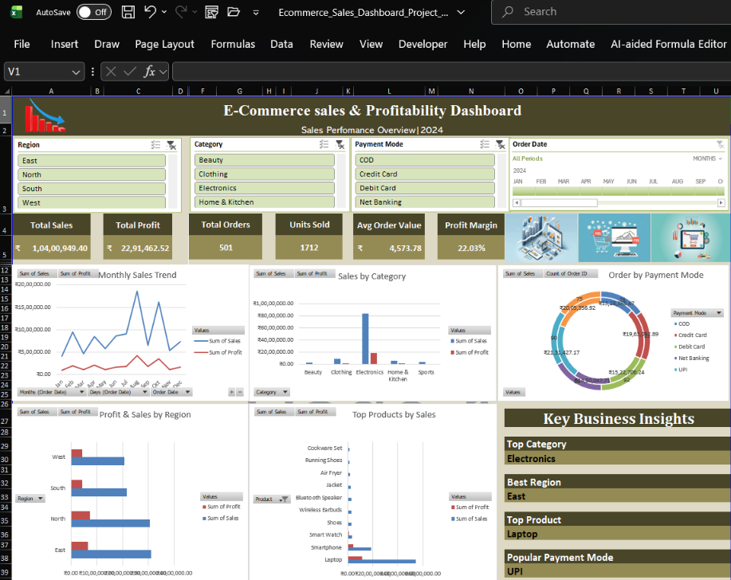

 # E-commerce Sales & Profitability Dashboard 📊

An interactive E-commerce Sales & Profitability Dashboard created using Microsoft Excel to analyze sales performance, profitability, customer behavior, and payment methods.

## 📸 Dashboard Preview

## 🛠️ Tools Used

- Microsoft Excel
- Pivot Tables
- Pivot Charts
- Slicers
- Excel Formulas
- Data Analysis & Visualization

## 📈 Key Analysis

- Total Sales
- Total Profit
- Sales by Category
- Sales by Region
- Payment Mode Analysis
- Profitability Analysis
- Customer and product performance

## 🎯 Objective

To analyze e-commerce sales data and create an interactive dashboard that helps identify important sales and profitability trends.

## 📁 Project Files

- `Ecommerce_Sales_Dashboard_Project_Data.xlsx` — Excel workbook containing the project data and dashboard.
 - `dashboard-preview.png` — Dashboard preview.
